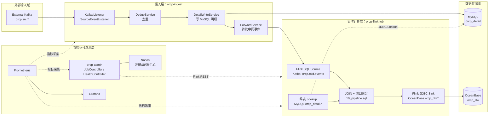
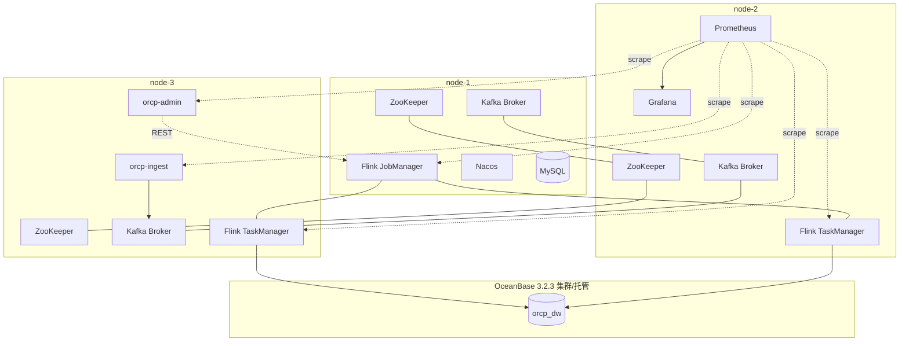
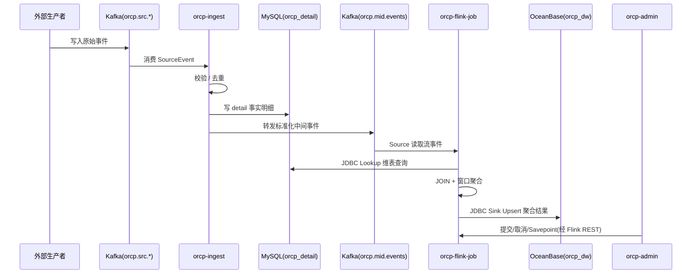

# ORCP 架构图（逻辑 / 物理 / 数据流向）

> 本文基于仓库当前实现（`orcp-ingest`、`orcp-flink-job`、`orcp-admin` 以及 `deploy` 配置）整理，便于设计评审与运维交接。

## 1) 逻辑架构图（Logical Architecture）

---

## 2) 物理架构图（Physical Deployment）

---

## 3) 数据流向图（Data Flow）

## 4) 使用建议

- 如需在 Git 平台渲染，优先使用支持 Mermaid 的 Markdown 查看器。
- 如果需要导出 PNG/SVG，可用 `mmdc`（Mermaid CLI）进行离线渲染。
- 图中节点名称已与仓库模块及脚本命名保持一致，便于追溯到实现。
