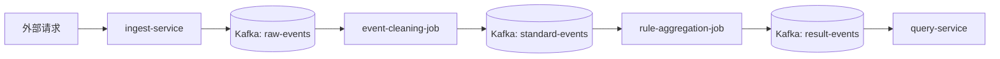

# 架构设计

## 1. 总体架构图

## 2. 服务职责

- gateway-service：统一入口占位与健康检查。
- ingest-service：接收事件并写入 raw-events。
- config-service：提供规则与 Topic 映射配置接口（内存实现）。
- query-service：消费 result-events 并提供查询接口。
- ops-service：提供作业状态和审计占位接口。

## 3. 数据流说明

1. 外部调用 `POST /api/events`。
2. ingest-service 校验后写入 `raw-events`。
3. event-cleaning-job 清洗后写入 `standard-events`。
4. rule-aggregation-job 聚合后写入 `result-events`。
5. query-service 消费并缓存，`GET /api/results/{key}` 查询。

## 4. 部署拓扑

- 本地：Docker Compose 启动 Kafka/Zookeeper。
- 服务：本地通过 Maven 启动各 Spring Boot 服务。
- 作业：打包后提交到 Flink 集群执行。
- 生产：通过 `infra/k8s` 下清单部署服务与作业。
